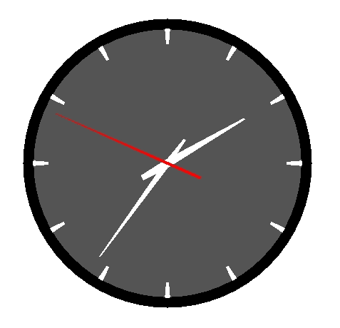

# Godot Analog Clock

GD Script to animate an analog clock.

## Usage

1. Download the zip file from the latest release
2. Extract it to `addons/godot-analog-clock`
3. Attach the `clock.gd` script to a node with a child node for each hand
4. Assign the hour, minute and second hand node paths

If hour, minute or second node paths are empty, those hands will not be
animated.

## Example

